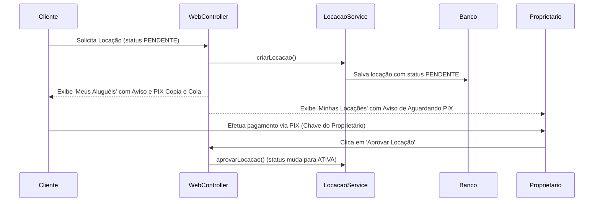

# Documentação Geral do Código (AgriRent)

Este documento apresenta uma visão geral da arquitetura da aplicação **AgriRent** e detalha o código que foi adicionado/modificado para implementar o fluxo de pagamento PIX e a integração com o banco de dados.

---

## 1. Arquitetura da Aplicação

O projeto é uma aplicação Spring Boot 3.2.5 em Java 17/23 com suporte a renderização server-side via **Thymeleaf**, persistence JDBC com **HikariCP** e banco de dados **MySQL / MariaDB**.

### Estrutura de Pacotes:
- `com.frota.model`: DTOs e entidades de domínio (`Locacao`, `Maquina`, `Proprietario`, `Usuario`, etc.).
- `com.frota.repository`: Camada de persistência JDBC manual usando `PreparedStatement` e mapeamento SQL customizado.
- `com.frota.service`: Camada de regras de negócio (`LocacaoService`, `AuthService`, `ProprietarioService`, etc.).
- `com.frota.controller`: Controllers Web (Thymeleaf MVC em `WebController`) e endpoints REST API.
- `templates`: Telas HTML Thymeleaf (`meus-alugueis.html`, `minhas-locacoes.html`, `anunciar.html`, etc.).

---

## 2. Detalhamento das Alterações de Código

### A. Classe de Domínio (`Locacao.java`)
Foram incluídas as propriedades referentes ao proprietário da máquina vinculada à locação:
- `proprietarioNome`: Armazena o nome do proprietário do equipamento.
- `proprietarioEmail`: Armazena o e-mail de contato do proprietário.
- `proprietarioTelefone`: Armazena o telefone do proprietário.
- `proprietarioChavePix`: Chave PIX cadastrada do proprietário.

**Métodos Adicionados:**
- `getChavePixValida()`: Retorna a chave PIX informada pelo proprietário ou, como fallback, o e-mail de contato ou chave padrão.
- `getCodigoPix()`: Método utilitário responsável por montar a string do código **PIX Copia e Cola** (padrão EMV BR Code) dinamicamente. Ele concatena a chave PIX, o valor total da locação formatado e o nome do favorecido.

---

### B. Camada de Repositório (`LocacaoRepository.java`)
Para que o objeto `Locacao` receba automaticamente os dados do proprietário em todas as listagens e buscas:

- **Constante `BASE_SELECT`:**
  Definida uma query SQL centralizada com múltiplos `LEFT JOIN`:
  ```sql
  SELECT l.*, u.nome as cliente_nome, m.nome as maquina_nome, m.tipo as maquina_tipo,
         up.nome as proprietario_nome, up.email as proprietario_email, 
         up.telefone as proprietario_telefone, p.chave_pix as proprietario_chave_pix
  FROM locacoes l 
  LEFT JOIN usuarios u ON l.cliente_id = u.id 
  LEFT JOIN maquinas m ON l.maquina_id = m.id 
  LEFT JOIN proprietarios p ON m.proprietario_id = p.id 
  LEFT JOIN usuarios up ON p.usuario_id = up.id
  ```
- **Método `mapear(ResultSet r)`:**
  Preenche os novos atributos de proprietário no objeto `Locacao` retornado pelas consultas SQL (`listarPorCliente`, `listarPorProprietario`, `buscarPorId`, etc.).

---

### C. Camada Visual / Templates Thymeleaf

#### `meus-alugueis.html` (Interface do Cliente)
- Adicionado bloco condicional para o status `PENDENTE`.
- Exibe o aviso **"⏳ Aguardando Pagamento via PIX"**.
- Mostra o nome, e-mail/contato do proprietário e a chave PIX cadastrada.
- Exibe o valor total calculado a ser pago.
- Inclui um campo de texto com o código **PIX Copia e Cola** e botão com ação JavaScript `navigator.clipboard.writeText(...)` para rápida cópia.

#### `minhas-locacoes.html` (Interface do Proprietário)
- Adicionado bloco condicional para o status `PENDENTE`.
- Exibe o aviso **"⏳ Aguardando Pagamento via PIX do Cliente"**.
- Exibe a chave PIX do proprietário e o código PIX copia e cola gerado.
- Instrução para o proprietário verificar o crédito em sua conta bancária e clicar no botão **"Aprovar Locação"** para ativar o aluguel.

---

### D. Conexão de Banco de Dados (`Conexao.java` e `application.properties`)
- Ajustada a porta de conexão do MySQL para a porta **3307** (padrão XAMPP/MariaDB ambiente local) sem senha.
- Ajustadas as propriedades do Spring Datasource no `application.properties` para sincronismo com a conexão HikariCP.

---

## 3. Fluxo de Funcionamento no Sistema


